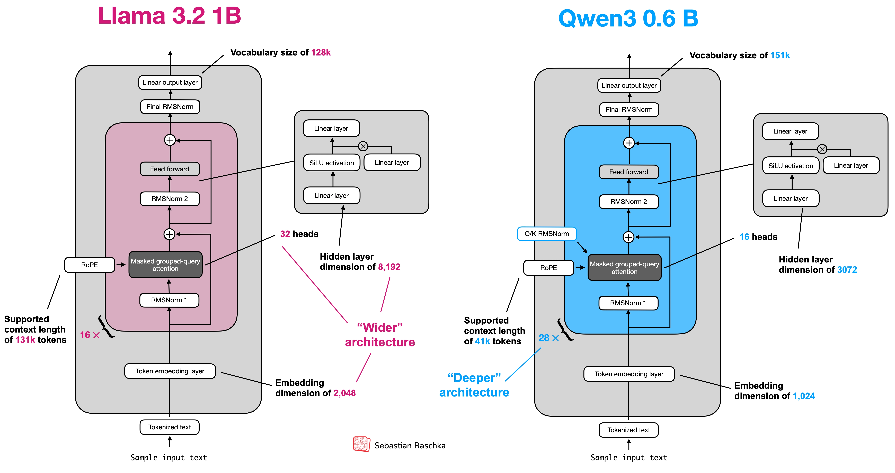
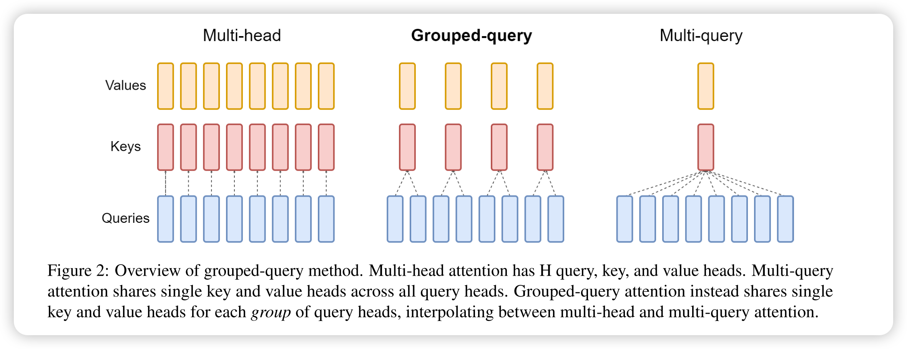
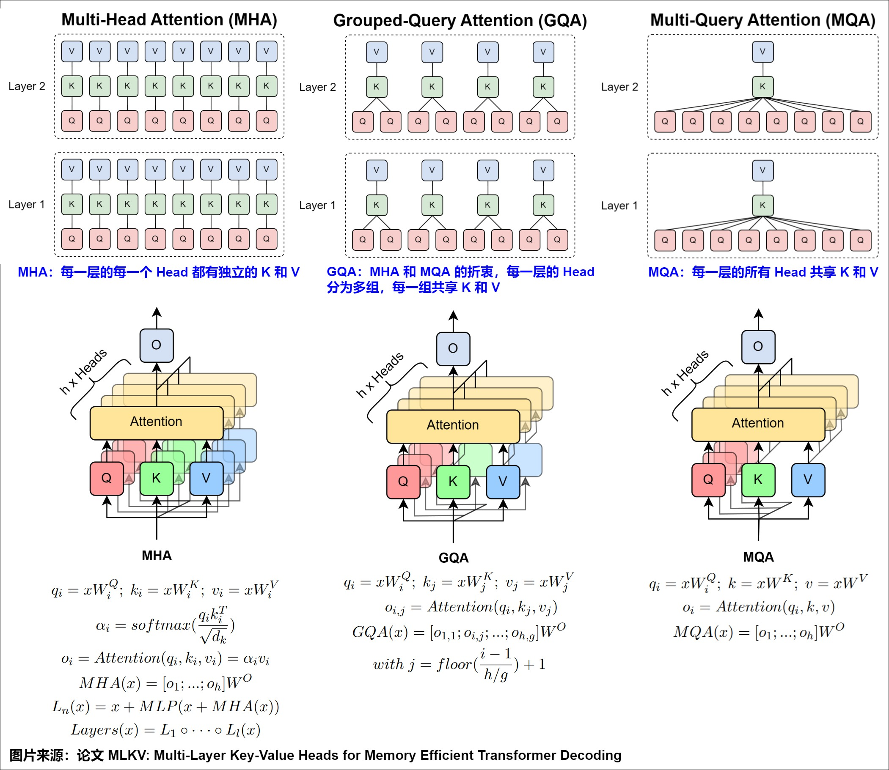
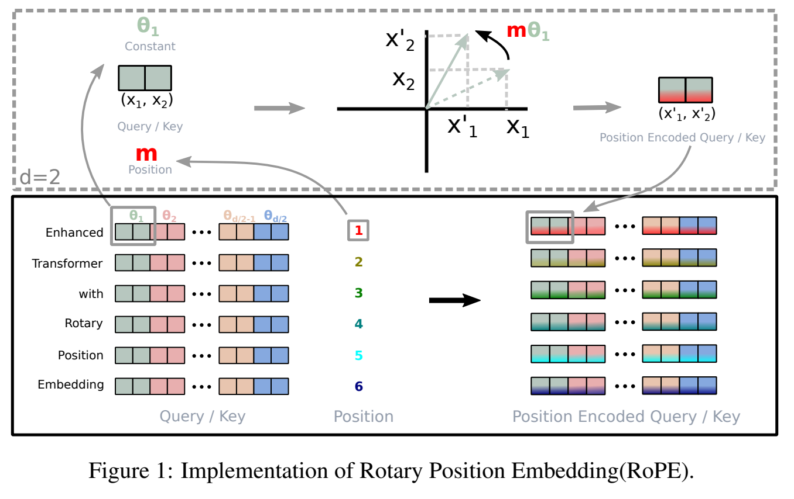

# Qwen3: from zero to megakernel 

This is a blog series to implement Qwen3 0.6B inference engine from zero to  and to document my learning progress. 

We will be reimplementing
- https://github.com/rasbt/LLMs-from-scratch/tree/main/ch05/11_qwen3
- https://github.com/adriancable/qwen3.c
- https://github.com/andrewkchan/yalm (for CUDA)
- https://github.com/zeux/calm (for Metal)
- https://github.com/Infatoshi/grokking-megakernels

I also like to use mega kerenl to accerlate inference rollout for 
- https://github.com/YuvrajSingh-mist/smolcluster

So how does qwen3 architecture look like. 
Here is the  Qwen3 architecture diagram by Sebastian Raschka.



Let's create a python file qwen3_torch.py

```python
import torch
prompt = "What is the Ultimate Answer to Life, the Universe, and Everything?"
```

But LLM cant read ASCII characters. It read vector. 
We can use Embedding to convert input into vector size of (1,1024).

When human reads a sentence, we read word by word "What-is-the..." but not by character "W-h-a-t...".
So the plan is to first split the prompt by space. 
and we get

```python
words = prompt.split(" ")
['What', 'is', 'the', 'Ultimate', 'Answer', 'to', 'Life,', 'the', 'Universe,', 'and', 'Everything?']
```

and we can embed each word and LLM will understand each word like a human does.
To save compute, we can also save the emdedding result vector to a lookup table.

Wait, google told me there are a million english vocab out there 
and LLM can understand multiple languages
and there will be new slogan every year
and if you looks closely to the architecture diagram

Qwen3 only have a vocab size of 151k and can chat with you can me.
The secret is the step between Sample input text and Token embedding layer, the tokenizer.

Tokenizer splits sentence into tokens. 
Tokens are like words but saves computation and handles edge cases above.

For example, if "Answer to" is a common phase that used together a lot, they can be merged into same token.
Such that when LLM process our prompt, it saves computation by one token.

The best way to understand tokenizer is to implement one.
- Character-Level Tokenizer (stoi/itos/BOS) https://www.deep-ml.com/problems/374
- Byte Pair Encoding (BPE) Tokenizer https://www.deep-ml.com/problems/380

Now, lets follow the architecture diagram to tokenizer our prompt
Instead of split by space, we want something like

```python
input_token_ids = tokenizer.encode(prompt)
```

We need to implement the class for tokenizer and the method encode.
```python
class Qwen3Tokenizer:
    def __init__(self):
        pass
    def encode(self, prompt):
        pass

tokenizer = Qwen3Tokenizer()
```

We need tokenizer.json that contains all of the 151k vocab
https://huggingface.co/Qwen/Qwen3-0.6B/blob/main/tokenizer.json

```python
import json
def __init__(self):
    with open(tokenizer_json_path, "r", encoding="utf-8") as f:
        data = json.load(f)
    self.vocab = data["model"]["vocab"]
    print(list(self.vocab)[:100])
    print(len(self.vocab))
tokenizer = Qwen3Tokenizer("./tokenizer.json")
```

And we can see
```python
['!', '"', '#', '$', '%', '&', "'", '(', ')', '*', '+', ',', '-', '.', '/', '0', '1', '2', '3', '4', '5', '6', '7', '8', '9', ':', ';', '<', '=', '>', '?', '@', 'A', 'B', 'C', 'D', 'E', 'F', 'G', 'H', 'I', 'J', 'K', 'L', 'M', 'N', 'O', 'P', 'Q', 'R', 'S', 'T', 'U', 'V', 'W', 'X', 'Y', 'Z', '[', '\\', ']', '^', '_', '`', 'a', 'b', 'c', 'd', 'e', 'f', 'g', 'h', 'i', 'j', 'k', 'l', 'm', 'n', 'o', 'p', 'q', 'r', 's', 't', 'u', 'v', 'w', 'x', 'y', 'z', '{', '|', '}', '~', '¡', '¢', '£', '¤', '¥', '¦']
151643
```

to implement encode function, we first split into characters and then do BPE merging 
before continue, make sure to finish Byte Pair Encoding (BPE) Tokenizer https://www.deep-ml.com/problems/380

My solution is
```python
    res = []
    while (num_merges>0):
        count = {}
        for text, freq in corpus.items():
            text = text.split(" ")
            for i in range(len(text)-1):
                pair = text[i] + " " + text[i+1]
                if pair in count:
                    count[pair] += freq
                else:
                    count[pair] = freq
        most_freq = sorted(count.items(), key=lambda x:x[1])[-1:]
        res.append((most_freq[0][0].split(" ")[0], most_freq[0][0].split(" ")[1]))

        new_corpus = {}
        for text, freq in corpus.items():
            if most_freq[0][0] in text:
                text = text.replace(most_freq[0][0], "".join(most_freq[0][0].split(" ")))
            new_corpus[text] = freq
        corpus = new_corpus
        num_merges -= 1

    return res
```

But the Byte Pair Encoding (BPE) Tokenizer exercise is for training, for inference we use a precomputed merge_rules from the json

```python
def __init__(self):
    with open(tokenizer_json_path, "r", encoding="utf-8") as f:
        data = json.load(f)
    self.vocab = data["model"]["vocab"]

    self.merge_rules = {}
    for i, merge in enumerate(data["model"]["merges"]):
        token_a, token_b = merge[0], merge[1]
        self.merge_rules[(token_a, token_b)] = i

def encode(self, prompt):
    # Step 1: Split into characters (initial tokens)
    tokens = list(prompt)
    
    # Step 2: BPE merging loop
    while True:
        best_merge_idx = float("inf")
        best_pos = -1
        best_pair = None
        
        # Find the best consecutive pair to merge
        for i in range(len(tokens) - 1):
            pair = (tokens[i], tokens[i + 1])
            if pair in self.merge_rules:
                merge_idx = self.merge_rules[pair]
                if merge_idx < best_merge_idx:
                    best_merge_idx = merge_idx
                    best_pos = i
                    best_pair = pair
        
        # No more merges possible
        if best_pos == -1:
            break
        
        # Apply the merge: combine tokens at best_pos
        merged_token = best_pair[0] + best_pair[1]
        tokens[best_pos] = merged_token
        del tokens[best_pos + 1]
    
    # Step 3: Convert tokens to IDs
    token_ids = []
    for token in tokens:
        if token in self.vocab:
            token_ids.append(self.vocab[token])
        else:
            # Handle unknown tokens (shouldn't happen with BPE)
            for char in token:
                token_ids.append(self.vocab.get(char, 0))
    
    return token_ids
```

and we get
```python
[3838, 0, 285, 0, 1782, 0, 43484, 3426, 0, 16141, 0, 983, 0, 25749, 11, 0, 1782, 0, 1806, 8034, 11, 0, 437, 0, 34964, 30]
```

but the token output list is not the same as official huggingface ouput
```python
from transformers import AutoTokenizer
tokenizer = AutoTokenizer.from_pretrained('Qwen/Qwen3-0.6B')
prompt = 'What is the Ultimate Answer to Life, the Universe, and Everything?'
official_tokens = tokenizer.encode(prompt)
print('Official tokens:', official_tokens)
[3838, 374, 279, 28850, 21806, 311, 9414, 11, 279, 28749, 11, 323, 20094, 30]
``` 

Problem: Character-Level Split Doesn't Match Vocab
tokens = list(prompt)  # ["W", "h", "a", "t", " ", "i", ...]
But HuggingFace BPE uses byte-level encoding, where:
- Space " " (byte 32) → "Ġ" (U+0120) in vocab
- Newline "\n" (byte 10) → "Ċ" (U+010A) in vocab
- etc.
Your split produces " " but vocab has "Ġ", so lookup fails → returns 0.

fix is to do bytes_to_unicode first 

```python
def bytes_to_unicode():
    """Map each byte to its unicode representation in BPE vocab"""
    # 33-126: Printable ASCII
    # 161-172: Latin-1 symbol
    # 174-255: More Latin-1
    bs = list(range(ord("!"), ord("~")+1)) + \ 
         list(range(ord("¡"), ord("¬")+1)) + \ 
         list(range(ord("®"), ord("ÿ")+1))     
    cs = bs[:]
    n = 0
    for b in range(256):
        if b not in bs:
            bs.append(b)
            cs.append(256 + n)
            n += 1
    return dict(zip(bs, [chr(c) for c in cs]))
BYTE_ENCODER = bytes_to_unicode()
```

and uses BYTE_ENCODER instead of character list(prompt)
```python
def encode(self, prompt):
    # Step 1: Split into characters (initial tokens)
    tokens = [BYTE_ENCODER[b] for b in prompt.encode("utf-8")]
    
    # Step 2: BPE merging loop
    while True:
```

now we get same token id as huggingface
```python
[3838, 374, 279, 28850, 21806, 311, 9414, 11, 279, 28749, 11, 323, 20094, 30]
```

now make convert our token id into tensors and use .unsqueeze(0) to add batch diemension
```python
input_token_ids_tensor = torch.tensor(input_token_ids).unsqueeze(0)
print(input_token_ids_tensor.shape)
```

```
torch.Size([1, 14])
```

we have converts prompt into token id, and we need to do something like out = model(token_ids)
so lets create our model first with config for qwen3 0.6B model
https://huggingface.co/Qwen/Qwen3-0.6B/blob/main/config.json

```python
QWEN3_CONFIG = {
    "vocab_size": 151_936,           # Vocabulary size
    "context_length": 40_960,        # Context length that was used to train the model
    "emb_dim": 1024,                 # Embedding dimension
    "n_heads": 16,                   # Number of attention heads
    "n_layers": 28,                  # Number of layers
    "hidden_dim": 3072,              # Size of the intermediate dimension in FeedForward
    "head_dim": 128,                 # Size of the heads in GQA
    "qk_norm": True,                 # Whether to normalize queries and keys in GQA
    "n_kv_groups": 8,                # Key-Value groups for grouped-query attention
    "rope_base": 1_000_000.0,        # The base in RoPE's "theta"
    "dtype": torch.bfloat16,         # Lower-precision dtype to reduce memory usage
}
class Qwen3Model(nn.Module):
    def __init__(self, cfg):
        super().__init__()
        print(cfg)
    def forward(self, in_idx):
        print("forward called:", in_idx)

model = Qwen3Model(QWEN3_CONFIG)
out = model(input_token_ids_tensor)
```

And you can see forward called because pytorch nn.Module __call__ is run upon class() and would call self.forward()

Next as the architecture diagram suggests, the model should embeds the input tokens
we add self.tok_emb = nn.Embedding() in init and use it in forward

```python
class Qwen3Model(nn.Module):
    def __init__(self, cfg):
        super().__init__()
        self.tok_emb = nn.Embedding(cfg["vocab_size"], cfg["emb_dim"], dtype=cfg["dtype"])

    def forward(self, in_idx):
        tok_embeds = self.tok_emb(in_idx)
        print(tok_embeds)
```

```
tensor([[[ 0.6992, -2.5469,  0.2461,  ...,  1.0469, -1.7812, -2.2812],
         [ 0.1963, -1.7578,  0.2559,  ...,  0.2129, -0.3262,  0.9648],
         [ 1.2734, -0.0928,  0.7539,  ...,  0.4453, -0.6875,  0.8750],
         ...,
         [ 1.1406,  0.9766, -0.8984,  ..., -1.6875,  0.8086, -1.0000],
         [ 0.2285, -0.3887,  0.6094,  ..., -0.5117,  0.2500, -1.3906],
         [-3.0938,  0.6680,  0.8828,  ..., -1.0391,  1.0234, -0.1040]]],
       dtype=torch.bfloat16, grad_fn=<EmbeddingBackward0>)
torch.Size([1, 14, 1024])
```

and we see each of the 14 token got its own 1024 size embedding vector
but we have not loaded the Qwen 0.6b model weight 
so the embedding is from a ramdomly initialized weight

Let's load our weight, you may need to change snapshots id
```bash
hf download Qwen/Qwen3-0.6B
ln -s ~/.cache/huggingface/hub/models--Qwen--Qwen3-0.6B/snapshots/c1899de289a04d12100db370d81485cdf75e47ca/ ./model
```


```python
from safetensors.torch import load_file 
hf_folder = "./model/"
weights_file = hf_folder + "model.safetensors"
weights_dict = load_file(weights_file)
```

for the load_file function, we will from safetensors.torch import load_file 
if u look at it source code, it just a 5 line function

```python
def load_file(
    filename: Union[str, os.PathLike], device: Union[str, int] = "cpu"
) -> Dict[str, torch.Tensor]:
    result = {}
    with safe_open(filename, framework="pt", device=device) as f:
        for k in f.offset_keys():
            result[k] = f.get_tensor(k)
    return result
``` 

but i will keep using import as we still need to import safe_open, Union, Dict even if we copy those 5 lines here
now we got out weights_dict
we need to load it into our qwen model

```python
load_weights_into_qwen(model, QWEN3_CONFIG, weights_dict)
```

and define our load_weights_into_qwen function
```python
def load_weights_into_qwen(model, param_config, params):
    def assign(left, right, tensor_name="unknown"):
        if left.shape != right.shape:
            raise ValueError(f"Shape mismatch in tensor '{tensor_name}'. Left: {left.shape}, Right: {right.shape}")
        
        with torch.no_grad():
            if isinstance(right, torch.Tensor):
                left.copy_(right)
            else:
                left.copy_(torch.as_tensor(right, dtype=left.dtype, device=left.device))
    
        return left 

    model.tok_emb.weight = assign(model.tok_emb.weight, params["model.embed_tokens.weight"], "model.embed_tokens.weight")

```

and we got our real embedding

```python
torch.Size([1, 14])
tensor([[[-0.0096,  0.0002, -0.0186,  ...,  0.0125,  0.0047,  0.0134],
         [ 0.0187,  0.0214, -0.0537,  ...,  0.0053,  0.0339,  0.0486],
         [-0.0070,  0.0248, -0.0510,  ...,  0.0132, -0.0129, -0.0156],
         ...,
         [ 0.0199,  0.0427, -0.0449,  ..., -0.0271,  0.0189, -0.0181],
         [-0.0339, -0.0056,  0.0273,  ..., -0.0189,  0.0028,  0.0076],
         [-0.0400,  0.0258, -0.0425,  ..., -0.0289,  0.0437,  0.0022]]],
       dtype=torch.bfloat16, grad_fn=<EmbeddingBackward0>)
torch.Size([1, 14, 1024])
```

next is the fun part, lets look at our diagram again, the embeddings are passed into transformer block 28 times
that mean it have 28 layer, lets implement trf_blocks in our Qwen3Model class 
```python
class Qwen3Model(nn.Module):
    def __init__(self, cfg):
        super().__init__()
        self.tok_emb = nn.Embedding(cfg["vocab_size"], cfg["emb_dim"], dtype=cfg["dtype"])
        self.trf_blocks = nn.ModuleList(  # ModuleList since Sequential can only accept one input, and we need `x, mask, cos, sin`
            [TransformerBlock(cfg) for _ in range(cfg["n_layers"])]
        )
    def forward(self, in_idx):
        tok_embeds = self.tok_emb(in_idx)
        x =  tok_embeds
        for block in self.trf_blocks:
            x = block(x)
        return x
```

and TransformerBlock class
```python
class TransformerBlock(nn.Module):
    def __init__(self, cfg):
        super().__init__()
    def forward(self, x):
        return x
```

so what does forward in TransformerBlock do?
from the diagram TransformerBlock filled in blue, the input embedding first go through
1. RMSNorm1
2. Masked grouped-query attention, with another input RoPE and Q/K RMSNorm
3. initial embeding is (+) added again as residual
4. RMSNorm2
5. Feed forward
6. input after 3. is added again

```python
class TransformerBlock(nn.Module):
    def __init__(self, cfg):
        super().__init__()
                    d_in=cfg["emb_dim"],

    def forward(self, x, mask, cos, sin):
        # Save initial embedding later used in step 3
        shortcut = x

        # 1. RMSNorm1
        x = self.norm1(x)

        # 2. Masked grouped-query attention, with another input RoPE and Q/K RMSNorm
        # causal mask to prevent token attends to the future token
        # cos sin is precomputed for rope
        x = self.att(x, mask, cos, sin)  # Shape [batch_size, num_tokens, emb_size]

        # 3. initial embeding is (+) added again as residual
        x = x + shortcut 

        # save for step 6
        shortcut = x

        # 4. RMSNorm2
        x = self.norm2(x)

        # 5. Feed forward
        x = self.ff(x)

        # 6. input after 3. is added again
        x = x + shortcut  
        return x
```

we will explain rope later and now just continue implment
self.norm1
self.att
self.norm2
self.ff

```python
class TransformerBlock(nn.Module):
    def __init__(self, cfg):
        super().__init__()
        self.att = GroupedQueryAttention(
            d_in=cfg["emb_dim"],
            num_heads=cfg["n_heads"],
            head_dim=cfg["head_dim"],
            num_kv_groups=cfg["n_kv_groups"],
            qk_norm=cfg["qk_norm"],
            dtype=cfg["dtype"]
        )
        self.ff = FeedForward(cfg)
        self.norm1 = RMSNorm(cfg["emb_dim"])
        self.norm2 = RMSNorm(cfg["emb_dim"])
```

and we have 3 new class here
GroupedQueryAttention
FeedForward
RMSNorm

```python
class GroupedQueryAttention(nn.Module):
    def __init__(self, cfg):
        super().__init__()
    def forward(self, x):
        return x

class FeedForward(nn.Module):
    def __init__(self, cfg):
        super().__init__()
    def forward(self, x):
        return x

class RMSNorm(nn.Module):
    def __init__(self, cfg):
        super().__init__()
    def forward(self, x):
        return x
```

GroupedQueryAttention uses shared KV head compare to Multi-head attention
it saves compute while keeping most of the LLM performace


detailed implmentation is 


from the diagram, GQA has h Heads, each head 
1. input projection for QKV seperately 
2. compute attention 
3. all head result go through ouput projection O

We will skip ROPE for now

```python
class GroupedQueryAttention(nn.Module):
    def __init__(
        self, d_in, num_heads, num_kv_groups, head_dim=None, qk_norm=False, dtype=None
    ):        
        super().__init__()
        self.W_query = nn.Linear(d_in, self.d_out, bias=False, dtype=dtype)
        self.W_key = nn.Linear(d_in, num_kv_groups * head_dim, bias=False, dtype=dtype)
        self.W_value = nn.Linear(d_in, num_kv_groups * head_dim, bias=False, dtype=dtype)

    def forward(self, x, mask, cos, sin):
        # 1. input projection for QKV seperately 
        queries = self.W_query(x)  # (b, num_tokens, num_heads * head_dim)
        keys = self.W_key(x)       # (b, num_tokens, num_kv_groups * head_dim)
        values = self.W_value(x)   # (b, num_tokens, num_kv_groups * head_dim)
        
        # 2. Attention
        attn_scores = queries @ keys.transpose(2, 3)
        attn_scores = attn_scores.masked_fill(mask, -torch.inf)
        attn_weights = torch.softmax(attn_scores / self.head_dim**0.5, dim=-1)

        # 3. all head result go through ouput projection O
        context = (attn_weights @ values).transpose(1, 2).reshape(b, num_tokens, self.d_out)
        return self.out_proj(context)

```

```
Output Projection in Multi-Head Attention
This code combines the results from all attention heads and projects them back to the original embedding dimension.
Step-by-Step Breakdown
1. attn_weights @ values
Shape: (b, n_heads, num_tokens, num_tokens) @ (b, n_heads, num_tokens, head_dim)
     = (b, n_heads, num_tokens, head_dim)
For each head, computes the weighted sum of values using attention scores.
2. .transpose(1, 2)
Before: (b, n_heads, num_tokens, head_dim)
After:  (b, num_tokens, n_heads, head_dim)
Moves n_heads next to head_dim so we can concatenate all heads' outputs.
3. .reshape(b, num_tokens, self.d_out)
Before: (b, num_tokens, n_heads, head_dim)
After:  (b, num_tokens, n_heads * head_dim) = (b, num_tokens, d_out)
Concatenates all head outputs by flattening the last two dimensions:
[head_0_output, head_1_output, ..., head_n_output]
4. self.out_proj(context)
Input:  (b, num_tokens, d_out)
Output: (b, num_tokens, d_out)
A linear layer that projects the concatenated multi-head output back to the model's embedding dimension. This allows the model to learn how to combine information from different heads.
Why This Matters
Step	Purpose
@ values	Apply attention weights to get context
transpose	Rearrange for concatenation
reshape	Concatenate all heads
out_proj	Learn optimal combination of heads
Visual Example
Input: "The cat sat on the mat"
Head 1 focuses on: subject-verb relationships
Head 2 focuses on: positional information  
Head 3 focuses on: noun phrases
After @ values: Each head produces its own interpretation
After reshape:  [head1_result, head2_result, head3_result] concatenated
After out_proj: Single unified representation combining all heads
The out_proj layer is crucial because it lets the model learn how to weight and combine the different types of information each head captures.
```


we read d_in from the config but we dont have d_out
d_out is = num_heads * head_dim

```python
class GroupedQueryAttention(nn.Module):
    def __init__(
        self, d_in, num_heads, num_kv_groups, head_dim=None, qk_norm=False, dtype=None
    ):        
        super().__init__()
        self.d_out = num_heads * head_dim

        self.W_query = nn.Linear(d_in, self.d_out, bias=False, dtype=dtype)
        self.W_key = nn.Linear(d_in, num_kv_groups * head_dim, bias=False, dtype=dtype)
        self.W_value = nn.Linear(d_in, num_kv_groups * head_dim, bias=False, dtype=dtype)
        self.out_proj = nn.Linear(self.d_out, d_in, bias=False, dtype=dtype)
```

and we see
```python
TypeError: forward() missing 3 required positional arguments: 'mask', 'cos', and 'sin'
```

we add block(x, mask, cos, sin) and provide them when calling out model

```python
class Qwen3Model(nn.Module):
    def forward(self, in_idx, mask, cos, sin):
        tok_embeds = self.tok_emb(in_idx)
        x =  tok_embeds
        for block in self.trf_blocks:
            x = block(x, mask, cos, sin)
        return x

mask, cos, sin = 1, 1, 1
out = model(input_token_ids_tensor, mask, cos, sin)
```

now we get
```python
attn_scores = queries @ keys.transpose(2, 3)
IndexError: Dimension out of range (expected to be in range of [-3, 2], but got 3)
```

because we miss Head Dimension Split,
we need to add self.num_heads to GroupedQueryAttention class and reshape QKV in forward

```python
class GroupedQueryAttention(nn.Module):
    def __init__(
        self, d_in, num_heads, num_kv_groups, head_dim=None, qk_norm=False, dtype=None
    ):
        super().__init__()
        self.num_heads = num_heads
        self.head_dim = head_dim
        self.num_kv_groups = num_kv_groups
        self.d_out = num_heads * head_dim
        ...

    def forward(self, x, mask, cos, sin):
        b, num_tokens, _ = x.shape

        # 1. input projection for QKV seperately 
        queries = self.W_query(x)  # (b, num_tokens, num_heads * head_dim)
        keys = self.W_key(x)       # (b, num_tokens, num_kv_groups * head_dim)
        values = self.W_value(x)   # (b, num_tokens, num_kv_groups * head_dim)
        
        # Split heads
        queries = queries.view(b, num_tokens, self.num_heads, self.head_dim).transpose(1, 2)
        keys = keys.view(b, num_tokens, self.num_kv_groups, self.head_dim).transpose(1, 2)
        values = values.view(b, num_tokens, self.num_kv_groups, self.head_dim).transpose(1, 2)
```

after split head, we also need to Expand K and V 
to do that, we need assert to ensure num_heads is disvisible by num_kv_groups
and self.group_size = num_heads // num_kv_groups

```python
class GroupedQueryAttention(nn.Module):
    def __init__(
        self, d_in, num_heads, num_kv_groups, head_dim=None, qk_norm=False, dtype=None
    ):
        ...
        assert num_heads % num_kv_groups == 0, "num_heads must be divisible by num_kv_groups"
        self.group_size = num_heads // num_kv_groups
        ...

    def forward(self, x, mask, cos, sin):
        ...
        # Expand K and V to match number of heads
        keys = keys.repeat_interleave(self.group_size, dim=1)
        values = values.repeat_interleave(self.group_size, dim=1)
        ...

```

and if you see this err
```python
TypeError: masked_fill() received an invalid combination of arguments - got (int, float), but expected one of:
 * (Tensor mask, Tensor value)
      didn't match because some of the arguments have invalid types: (int, float)
 * (Tensor mask, Number value)
      didn't match because some of the arguments have invalid types: (int, float)
```

congrats, our reshape works and we can continue to implement a real mask for attention
for causal mask, it is a mask that left bottom traiangle of a square is filled with 1 , other is 0
that is we make a square, draw a diagonal from top left corner to right bottom corner, we cut and fill the left triangle half as 1
in pytorch, we can do this with torch.triu

```python
class Qwen3Model(nn.Module):
    def __init__(self, cfg):
        super().__init__()
        self.tok_emb = nn.Embedding(cfg["vocab_size"], cfg["emb_dim"], dtype=cfg["dtype"])
        self.trf_blocks = nn.ModuleList(  # ModuleList since Sequential can only accept one input, and we need `x, mask, cos, sin`
            [TransformerBlock(cfg) for _ in range(cfg["n_layers"])]
        )

    def forward(self, in_idx, mask, cos, sin):
        tok_embeds = self.tok_emb(in_idx)
        x =  tok_embeds

        num_tokens = x.shape[1]
        mask = torch.triu(torch.ones(num_tokens, num_tokens, device=x.device, dtype=torch.bool), diagonal=1)

        for block in self.trf_blocks:
            x = block(x, mask, cos, sin)
        return x
```

and we should get no error
great, now lets implement FeedForward and RMSNorm
FeedForward is stright forward, from config.json hidden_act we know the activaiton in use is silu

and look at our favourite diagram again, on the right side we saw Feed forward do
1. Linear layer(x)
2. Silu(1. result)
3. Linear layer(x)
4. step 2 result * step 3 result
5. Linear(4. result) 

```python
class FeedForward(nn.Module):
    def __init__(self, cfg):
        super().__init__()
        self.fc1 = nn.Linear(cfg["emb_dim"], cfg["hidden_dim"], dtype=cfg["dtype"], bias=False)
        self.fc2 = nn.Linear(cfg["emb_dim"], cfg["hidden_dim"], dtype=cfg["dtype"], bias=False)
        self.fc3 = nn.Linear(cfg["hidden_dim"], cfg["emb_dim"], dtype=cfg["dtype"], bias=False)

    def forward(self, x):
        x_fc1 = self.fc1(x)
        x_fc2 = self.fc2(x)
        x = nn.functional.silu(x_fc1) * x_fc2
        return self.fc3(x)
```

for RMSNorm, its root-mean-square, that means we do sqrt(mean(power(x,2)))
in torch we do x.pow(2).mean(dim=-1, keepdim=True), which is the variance
and then do torch.rsqrt(variance)

some details here are
- add a small number self.eps to prevent zero input
- add trained self.scale 

```python
class RMSNorm(nn.Module):
    def __init__(self, emb_dim, eps=1e-6):
        super().__init__()
        self.eps = eps
        self.scale = nn.Parameter(torch.ones(emb_dim))

    def forward(self, x):
        input_dtype = x.dtype
        variance = x.pow(2).mean(dim=-1, keepdim=True)
        norm_x = x * torch.rsqrt(variance + self.eps)
        norm_x = norm_x * self.scale
        return norm_x.to(input_dtype)
```

we have finished the diagram transformer block filled in blue
The remainig are 
1. Final RMSNorm
2. Linear Output layer


```python
class Qwen3Model(nn.Module):
    def __init__(self, cfg):
        super().__init__()
        self.tok_emb = nn.Embedding(cfg["vocab_size"], cfg["emb_dim"], dtype=cfg["dtype"])
        self.trf_blocks = nn.ModuleList(  # ModuleList since Sequential can only accept one input, and we need `x, mask, cos, sin`
            [TransformerBlock(cfg) for _ in range(cfg["n_layers"])]
        )
        self.final_norm = RMSNorm(cfg["emb_dim"])
        self.out_head = nn.Linear(cfg["emb_dim"], cfg["vocab_size"], bias=False, dtype=cfg["dtype"])
        self.cfg = cfg

    def forward(self, in_idx, mask, cos, sin):
        tok_embeds = self.tok_emb(in_idx)
        x =  tok_embeds

        num_tokens = x.shape[1]
        mask = torch.triu(torch.ones(num_tokens, num_tokens, device=x.device, dtype=torch.bool), diagonal=1)

        for block in self.trf_blocks:
            x = block(x, mask, cos, sin)
        x = self.final_norm(x)
        logits = self.out_head(x.to(self.cfg["dtype"]))
        return logits
```

now we compute sin and cos for ROPE
I dont understand the math very well now, i will add explannation here later


https://www.deep-ml.com/problems/381

```python
def compute_rope_params(head_dim, theta_base=10_000, context_length=4096, dtype=torch.float32):
    assert head_dim % 2 == 0, "Embedding dimension must be even"

    # Compute the inverse frequencies
    inv_freq = 1.0 / (theta_base ** (torch.arange(0, head_dim, 2, dtype=dtype)[: (head_dim // 2)].float() / head_dim))

    # Generate position indices
    positions = torch.arange(context_length, dtype=dtype)

    # Compute the angles
    angles = positions.unsqueeze(1) * inv_freq.unsqueeze(0)  # Shape: (context_length, head_dim // 2)

    # Expand angles to match the head_dim
    angles = torch.cat([angles, angles], dim=1)  # Shape: (context_length, head_dim)

    # Precompute sine and cosine
    cos = torch.cos(angles)
    sin = torch.sin(angles)

    return cos, sin

class Qwen3Model(nn.Module):
    def __init__(self, cfg):
        super().__init__()
        self.tok_emb = nn.Embedding(cfg["vocab_size"], cfg["emb_dim"], dtype=cfg["dtype"])
        self.trf_blocks = nn.ModuleList(  # ModuleList since Sequential can only accept one input, and we need `x, mask, cos, sin`
            [TransformerBlock(cfg) for _ in range(cfg["n_layers"])]
        )
        self.final_norm = RMSNorm(cfg["emb_dim"])
        self.out_head = nn.Linear(cfg["emb_dim"], cfg["vocab_size"], bias=False, dtype=cfg["dtype"])
        self.cfg = cfg
        if cfg["head_dim"] is None:
            head_dim = cfg["emb_dim"] // cfg["n_heads"]
        else:
            head_dim = cfg["head_dim"]
        cos, sin = compute_rope_params(
            head_dim=head_dim,
            theta_base=cfg["rope_base"],
            context_length=cfg["context_length"]
        )
        self.register_buffer("cos", cos, persistent=False)
        self.register_buffer("sin", sin, persistent=False)
```

we added compute_rope_params, call it in Qwen3Model __init__ and set head_dim = cfg["emb_dim"] // cfg["n_heads"]
if it was not provided

now we need to actually load the weight from safetensor for all of the above trainabel parameters
lets improve the load_weights_into_qwen function

```python
def load_weights_into_qwen(model, param_config, params):
    def assign(left, right, tensor_name="unknown"):
        if left.shape != right.shape:
            raise ValueError(f"Shape mismatch in tensor '{tensor_name}'. Left: {left.shape}, Right: {right.shape}")
        
        with torch.no_grad():
            if isinstance(right, torch.Tensor):
                left.copy_(right)
            else:
                left.copy_(torch.as_tensor(right, dtype=left.dtype, device=left.device))
    
        return left 

    model.tok_emb.weight = assign(model.tok_emb.weight, params["model.embed_tokens.weight"], "model.embed_tokens.weight")
    for l in range(param_config["n_layers"]):
        block = model.trf_blocks[l]
        att = block.att

        # Q, K, V projections
        att.W_query.weight = assign(
            att.W_query.weight,
            params[f"model.layers.{l}.self_attn.q_proj.weight"],
            f"model.layers.{l}.self_attn.q_proj.weight"
        )
        att.W_key.weight = assign(
            att.W_key.weight,
            params[f"model.layers.{l}.self_attn.k_proj.weight"],
            f"model.layers.{l}.self_attn.k_proj.weight"
        )
        att.W_value.weight = assign(
            att.W_value.weight,
            params[f"model.layers.{l}.self_attn.v_proj.weight"],
            f"model.layers.{l}.self_attn.v_proj.weight"
        )

        # Output projection
        att.out_proj.weight = assign(
            att.out_proj.weight,
            params[f"model.layers.{l}.self_attn.o_proj.weight"],
            f"model.layers.{l}.self_attn.o_proj.weight"
        )

        # QK norms
        if hasattr(att, "q_norm") and att.q_norm is not None:
            att.q_norm.scale = assign(
                att.q_norm.scale,
                params[f"model.layers.{l}.self_attn.q_norm.weight"],
                f"model.layers.{l}.self_attn.q_norm.weight"
            )
        if hasattr(att, "k_norm") and att.k_norm is not None:
            att.k_norm.scale = assign(
                att.k_norm.scale,
                params[f"model.layers.{l}.self_attn.k_norm.weight"],
                f"model.layers.{l}.self_attn.k_norm.weight"
            )

        # Attention layernorm
        block.norm1.scale = assign(
            block.norm1.scale,
            params[f"model.layers.{l}.input_layernorm.weight"],
            f"model.layers.{l}.input_layernorm.weight"
        )

        # Feedforward weights
        block.ff.fc1.weight = assign(
            block.ff.fc1.weight,
            params[f"model.layers.{l}.mlp.gate_proj.weight"],
            f"model.layers.{l}.mlp.gate_proj.weight"
        )
        block.ff.fc2.weight = assign(
            block.ff.fc2.weight,
            params[f"model.layers.{l}.mlp.up_proj.weight"],
            f"model.layers.{l}.mlp.up_proj.weight"
        )
        block.ff.fc3.weight = assign(
            block.ff.fc3.weight,
            params[f"model.layers.{l}.mlp.down_proj.weight"],
            f"model.layers.{l}.mlp.down_proj.weight"
        )
        block.norm2.scale = assign(
            block.norm2.scale,
            params[f"model.layers.{l}.post_attention_layernorm.weight"],
            f"model.layers.{l}.post_attention_layernorm.weight"
        )

    # Final normalization and output head
    model.final_norm.scale = assign(model.final_norm.scale, params["model.norm.weight"], "model.norm.weight")

    if "lm_head.weight" in params:
        model.out_head.weight = assign(model.out_head.weight, params["lm_head.weight"], "lm_head.weight")
    else:
        model.out_head.weight = model.tok_emb.weight
        print("Model uses weight tying.")
```

we also need apply_rope to GQA forward

```python
def apply_rope(x, cos, sin):
    # x: (batch_size, num_heads, seq_len, head_dim)
    batch_size, num_heads, seq_len, head_dim = x.shape
    assert head_dim % 2 == 0, "Head dimension must be even"

    # Split x into first half and second half
    x1 = x[..., : head_dim // 2]  # First half
    x2 = x[..., head_dim // 2 :]  # Second half

    # Adjust sin and cos shapes
    cos = cos[:seq_len, :].unsqueeze(0).unsqueeze(0)  # Shape: (1, 1, seq_len, head_dim)
    sin = sin[:seq_len, :].unsqueeze(0).unsqueeze(0)

    # Apply the rotary transformation
    rotated = torch.cat((-x2, x1), dim=-1)
    x_rotated = (x * cos) + (rotated * sin)

    # It's ok to use lower-precision after applying cos and sin rotation
    return x_rotated.to(dtype=x.dtype)
```

```python
class GroupedQueryAttention(nn.Module):
    def forward(self, x, mask, cos, sin):
        ...
        # Apply RoPE
        queries = apply_rope(queries, cos, sin)
        keys = apply_rope(keys, cos, sin)

        # Expand K and V to match number of heads
        keys = keys.repeat_interleave(self.group_size, dim=1)
        values = values.repeat_interleave(self.group_size, dim=1)
        ...
```

we will get 
```
cos = cos[:seq_len, :].unsqueeze(0).unsqueeze(0)  # Shape: (1, 1, seq_len, head_dim)
TypeError: 'int' object is not subscriptable
```

because mask, sin, cos was set to 1 before and passed to model forward. We need to fix that
```python
out = model(input_token_ids_tensor)
```

```python
class Qwen3Model(nn.Module):
    def forward(self, in_idx):
        ...
        for block in self.trf_blocks:
            x = block(x, mask, self.cos, self.sin)
        ...
```

Great, no more error
we forgot QK Norm in GQA before, it was shown in the diagram and we forgot to handle that
it is the last puzzle before we can do the text generation loop

```python
class GroupedQueryAttention(nn.Module):
    def __init__(
        self, d_in, num_heads, num_kv_groups, head_dim=None, qk_norm=False, dtype=None
    ):
        ...
        if qk_norm:
            self.q_norm = RMSNorm(head_dim, eps=1e-6)
            self.k_norm = RMSNorm(head_dim, eps=1e-6)
        else:
            self.q_norm = self.k_norm = None
        ...
        
    def forward(self, x, mask, cos, sin):
        ...
        # Optional normalization
        if self.q_norm:
            queries = self.q_norm(queries)
        if self.k_norm:
            keys = self.k_norm(keys)

        # Apply RoPE
        queries = apply_rope(queries, cos, sin)
        keys = apply_rope(keys, cos, sin)
        ...
```

Great we have everything we need and we can generate our first token
```

```